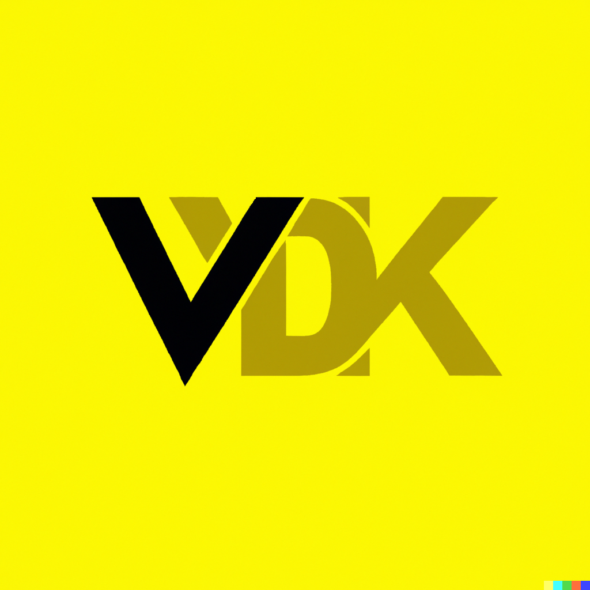

# Vestelion Development Kit (VDK)

VDK, which stands for Vestelion Development Kit, is an open-source software development kit written in Java. Its main goal is to simplify and enhance the software development process by providing additional functionalities that are not present in the standard Java Development Kit (JDK).

One of the core features of VDK is the integration of Promises, which allows developers to easily manage asynchronous code execution and data flow. VDK's Promise implementation is modeled after the JavaScript Promise API, providing a familiar interface for developers who are already familiar with this programming paradigm.

Another key feature of VDK is its logging system, which allows developers to easily monitor and debug their applications. VDK provides a flexible logging API, enabling developers to configure and customize logging output to suit their specific needs.

In addition to Promises and Logging, VDK also provides a range of other useful functionalities, including data structures, utility classes, and IO operations. These features are designed to help developers write clean, concise, and efficient code, while reducing the overall complexity of their projects.

## Contributions

VDK is an open-source project, and contributions from the community are always welcome. Developers can contribute to the project by submitting bug reports, feature requests, or code contributions via the project's GitHub page. With its focus on simplicity and functionality, VDK is a valuable tool for any Java developer looking to streamline their workflow and build better software.

## Documentation

In addition to the source code and documentation in the main VDK repository, users can also find additional information and resources in the [project's wiki](https://github.com/vestelion/Vestelion-Development-Kit/wiki)
. The wiki contains a variety of useful resources, including tutorials, examples, and additional documentation that can help users get started with VDK and make the most of its features.

The VDK wiki is maintained by the project's community, and contributions are welcome from anyone who wishes to help improve and expand the available resources. Whether you are a new user looking to get started with VDK, or an experienced developer looking to explore its advanced features, the VDK wiki is a valuable resource that can help you achieve your goals.

## VDK Logo

## Tags

- [java](https://github.com/topics/java)
- [open-source](https://github.com/topics/open-source)
